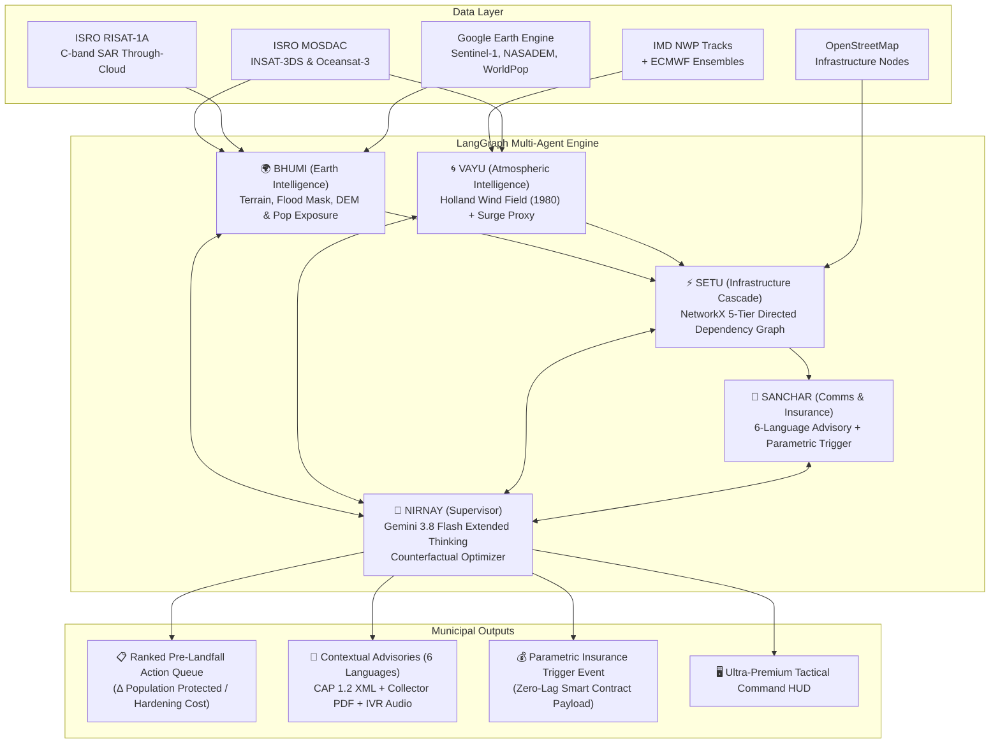

# 🌪️ VAYU-RAKSHA (वायु रक्षा)
### Anticipatory Cyclone & Infrastructure Cascade Intelligence Platform
> *"From satellite to autonomous municipal action — 72 hours before landfall"*

[-4285F4?style=flat&logo=google&logoColor=white)](https://github.com/Niss54/gdg)
[](https://github.com/Niss54/gdg)
[](https://github.com/Niss54)
[](https://github.com/Niss54/gdg)
[](https://cloud.google.com/vertex-ai)
[](https://mosdac.gov.in)
[](https://earthengine.google.com)
[](https://langchain-ai.github.io/langgraph/)

---

## 🎯 The Gap We Fill

Every existing cyclone forecasting tool stops at **Advisory Generation** (*"where will the storm hit?"* and *"which area is in the red zone?"*).  
**None models how failures CASCADE across interdependent municipal infrastructure networks**, nor optimizes **PRE-LANDFALL hardening actions** before gale-force winds lock down emergency teams.

When a coastal 220kV electrical substation fails:
1. Hospitals and trauma centers lose mains power, activating diesel backup with limited 8-hour fuel stocks.
2. Cellular towers lose electricity, severing NDRF rescue coordination and early warning broadcasts.
3. Traffic signals and arterial causeways become submerged or paralyzed, blocking evacuation convoys.
4. Municipal water treatment plants and pump stations stop, precipitating an acute potable water crisis.

**VAYU-RAKSHA** is the first platform to model this cross-infrastructure ripple effect using a directed **NetworkX Interdependency Graph**, evaluate pre-landfall interventions through a **Counterfactual Scenario Engine**, fuse **ISRO native satellites (INSAT-3DS, RISAT-1A C-band SAR)** with **Google Earth Engine**, and autonomously generate ranked municipal action queues and parametric insurance triggers up to **72 hours before landfall**.

---

## 🧠 5-Agent LangGraph Architecture

VAYU-RAKSHA is built on a typed `CycloneState` StateGraph managed by 5 specialized autonomous agents:



| Agent | Responsibility | Core Models & Libraries |
|---|---|---|
| **👑 NIRNAY** | Supervisor, Counterfactual Optimizer, Situation Report synthesis | Gemini 3.8 Flash (Extended Thinking), LangGraph StateGraph |
| **🌍 BHUMI** | Satellite SAR flood detection through cloud cover, 30m terrain DEM, exposure | ISRO RISAT-1A, GEE Sentinel-1 SAR, NASADEM, WorldPop |
| **🌀 VAYU** | Holland (1980) parametric wind field, bathtub surge proxy, rainfall grid | MOSDAC INSAT-3DS, IMD NWP, ECMWF, NumPy, SciPy |
| **⚡ SETU** | NetworkX 5-tier cascade failure graph, flood-penalized evacuation routing | NetworkX, Shapely, GeoPandas, OSMnx Dijkstra |
| **📢 SANCHAR** | Multilingual advisory dispatch (6 languages), IVR audio, parametric trigger | Gemini multilingual prompts, gTTS, Jinja2, Smart Contract JSON |

---

## ⚡ The 5-Layer Infrastructure Cascade Engine

VAYU-RAKSHA represents coastal districts as a directed dependency graph $G=(V, E)$:
- **L1 — Transmission & Substations (220kV/132kV)**: Identified for pre-isolation to prevent grid blowouts.
- **L2 — Hospitals & Trauma Centers**: Backup fuel stockpile requirements computed per bed and ICU suite.
- **L3 — Arterial Roads & Bridges**: Evacuation routes dynamically rerouted when water levels exceed clearances.
- **L4 — Telecom Towers & NDRF Repeater Links**: Generator backup activations scheduled before gales strike.
- **L5 — Water Treatment & Pumping Stations**: Emergency potable reserve filling alerts prioritized.

### Sample Output: Ranked Pre-Landfall Hardening Queue
```
[T-36h] PRIORITY #1 (CRITICAL): De-energize coastal substations S-7, S-12, S-19
        Protected: 3 District Hospitals, 2 Multi-purpose Shelters, 1 Desalination Plant
        Cascade Nodes Saved: 14 downstream | Window: T-36h to T-30h

[T-48h] PRIORITY #2 (HIGH): Pre-position 15,000L fuel tankers at District Hospital H-3 & H-8
        Protected: 2 ICUs (48 beds), Blood Banks, Trauma OT Suites
        Cascade Nodes Saved: 8 downstream | Window: T-48h to T-40h

[T-12h] PRIORITY #3 (HIGH): Close Coastal Highway Bridge RB-22 (Expected Surge: 2.3m)
        Action: Reroute evacuation convoys via inland Corridor-4
        Cascade Nodes Saved: Zero transit strandings | Window: T-12h to T-6h
```

---

## 🛰️ India-First Native Satellite Intelligence

Unlike standard projects that only rely on Western satellite products, VAYU-RAKSHA natively fuses:
1. **ISRO MOSDAC (INSAT-3DS)**: 10-minute rapid update cloud motion vectors, Dvorak cyclone intensity ratings, and eyewall cloud-top temperatures.
2. **ISRO RISAT-1A C-band SAR**: Active synthetic aperture radar that penetrates dense cyclonic storm clouds to extract ground-truth flood inundation masks at 3m resolution.
3. **ISRO Oceansat-3**: Ku-band scatterometer ocean wind vectors and Bay of Bengal sea surface temperature anomalies.
4. **Google Earth Engine (GEE)**: Sentinel-1 SAR GRD, NASA NASADEM 30m, JRC Global Surface Water, and WorldPop population grids.

---

## 🛡️ Instant Parametric Insurance Trigger

Traditional disaster relief financing suffers from a 4-to-8 week loss adjustment lag. VAYU-RAKSHA features an automated parametric trigger:
- **Condition**: Sustained wind speed $\ge 89\text{ km/h}$ within 50km radius **AND** satellite flood extent $\ge 30\%$ verified by Sentinel-1 or RISAT-1A SAR.
- **Action**: Emits a cryptographically verified JSON trigger payload to insurers and relief agencies, enabling automatic liquidity disbursement within hours of landfall.

---

## 💻 Tech Stack

- **Frontend:** Next.js 16 (React 19), Tailwind CSS 4, Deck.gl, MapLibre GL, Recharts, Lucide Icons
- **Backend API:** FastAPI (Python 3.12+), Pydantic v2, WebSockets for live telemetry
- **AI & Agents:** LangGraph, Google Vertex AI (Gemini 3.8 Flash & Gemini 3.7 Flash)
- **Geospatial & Physics:** Google Earth Engine Python API, GeoPandas, Shapely, NumPy, SciPy
- **Graph & Algorithms:** NetworkX (Cascade Graph), OSMnx (Dijkstra Evacuation Routing)
- **Audio & Documents:** gTTS (IVR simulation), ReportLab / Jinja2 (Collector Briefs)

---

## 🚀 Getting Started

### Prerequisites
- Node.js 20+ & pnpm
- Python 3.11+
- Google Cloud Vertex AI Credentials (`GOOGLE_APPLICATION_CREDENTIALS`)

### Running the Tactical Command Center (Web)
```bash
cd apps/web
pnpm install
pnpm dev
```
Open [http://localhost:3000](http://localhost:3000) to view the next-gen command HUD.

### Running the Geo & Cascade API (Python)
```bash
cd services/geo
pip install -e .
uvicorn shadowcast_geo.api:app --reload --port 8000
```

---

## 👥 Team Syntrix

- **Nishant Maurya** — Lead Developer & AI Architect ([github.com/Niss54](https://github.com/Niss54))
- **Submission:** Build with AI: Code for Communities (2nd Edition) · Track 5
- **Official Repository:** [https://github.com/Niss54/gdg](https://github.com/Niss54/gdg)
