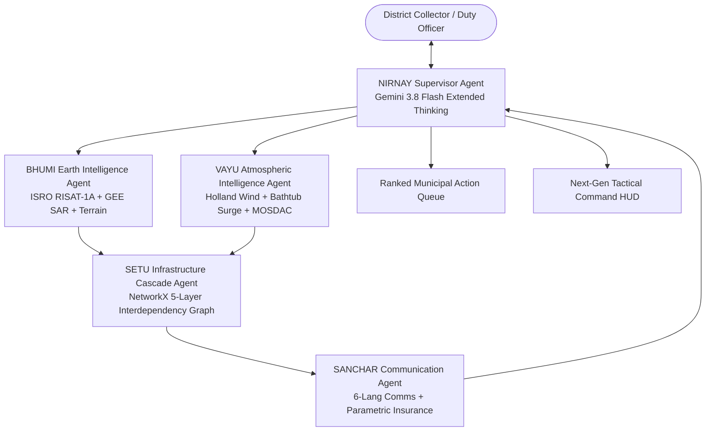

# 🌪️ VAYU-RAKSHA — Product Requirements Document (PRD)

> **Project:** VAYU-RAKSHA (वायु रक्षा) — Anticipatory Cyclone & Infrastructure Cascade Intelligence Platform  
> **Track:** Track 5 — Track-Based Cyclone Impact & Infrastructure Vulnerability Forecaster  
> **Hackathon:** Build with AI: Code for Communities (2nd Edition)  
> **Team:** SYNTRIX  
> **Lead Developer & AI Architect:** Nishant Maurya ([github.com/Niss54](https://github.com/Niss54))  
> **Repository:** [https://github.com/Niss54/gdg](https://github.com/Niss54/gdg)  
> **Version:** 2.0.0 (Production Blueprint)  
> **Status:** 🟢 Approved for Phased Execution  

---

## 📌 1. Executive Summary & Vision

### 1.1 The Core Problem
In the last 50 years, Bay of Bengal cyclones have claimed more than 500,000 lives. Today, meteorology delivers track forecasts up to 72 hours in advance. **Yet critical infrastructure continues to catastrophically fail.**
Existing disaster forecasters (including academic models and hackathon submissions) stop at **Observation & Passive Advisory**:
- They report *where* the cyclone will make landfall.
- They show static risk maps or simple spatial buffer intersections.
- **The Fatal Gap:** *None models how infrastructure failures CASCADE across interdependent networks (Power $\rightarrow$ Hospitals $\rightarrow$ Telecom $\rightarrow$ Water $\rightarrow$ Arterial Roads), and none optimizes PRE-LANDFALL municipal action sequences before gales make intervention impossible.*

When a coastal 220kV transmission substation trips, backup generators at trauma centers run out of diesel within 8 hours, telecom towers go dark halting NDRF rescue coordination, traffic lights fail jamming coastal evacuation routes, and water pumping stations halt causing drinking water contamination.

### 1.2 The VAYU-RAKSHA Solution
**VAYU-RAKSHA** is an end-to-end Anticipatory Cyclone & Infrastructure Cascade Intelligence Platform operating under the motto:  
> *"From satellite to autonomous municipal action — 72 hours before landfall."*

VAYU-RAKSHA is powered by:
1. **True 5-Agent LangGraph Architecture** (NIRNAY Supervisor, BHUMI Earth Intelligence, VAYU Atmospheric Intelligence, SETU Infrastructure Cascade, SANCHAR Multilingual Comms & Insurance).
2. **First India-Native Satellite Fusion**: Directly fusing ISRO MOSDAC (INSAT-3DS 10-min cyclone intensity & cloud motion vectors, Oceansat-3 scatterometer) and ISRO RISAT-1A C-band SAR through-cloud radar flood penetrations with Google Earth Engine (Sentinel-1 SAR, NASADEM 30m, GPM IMERG, WorldPop).
3. **NetworkX Infrastructure Cascade Failure Engine**: Directed multi-layer dependency graph $G=(V, E)$ modeling real failure propagation across 5 interdependent municipal tiers.
4. **Counterfactual Pre-Landfall Action Optimizer**: Evaluates "what-if" interventions at $T-72\text{h}$ to $T-24\text{h}$ to rank proactive municipal hardening orders by $\frac{\Delta \text{Population Protected}}{\text{Disruption Cost}}$.
5. **Parametric Insurance Automated Trigger Engine**: Instant programmatic payout event generation when sustained wind $\ge 89\text{ km/h}$ within 50km + satellite flood extent $\ge 30\%$ are verified, eliminating 4–6 week bureaucratic adjustment delays.
6. **Ultra-Premium Command-Center UI/UX**: Next-generation tactical mission control interface featuring real-time 5-Agent HUD telemetry, interactive NetworkX topology canvas, counterfactual sandbox, 4D scrubbable GIS radar/satellite map, and voice-enabled Duty Analyst powered by Gemini 3.8 Flash.

---

## 👥 2. Target Personas & Stakeholders

| Persona | Role | Core Need & Pain Point | VAYU-RAKSHA Benefit |
|---|---|---|---|
| **District Magistrate / Collector** | Head of District Disaster Management Authority (DDMA) | Overwhelmed by generic weather bulletins; needs unambiguous, prioritized pre-landfall hardening orders before gales lock down crews. | Ranked Action Queue with lead times ($T-48\text{h}$, $T-36\text{h}$), lives-protected counterfactual metrics, and 1-click CAP 1.2 signoff. |
| **NDRF Commandant / Emergency Services** | Rescue & Evacuation Operations | Evacuation corridors getting flooded mid-transit; communication blackouts due to cell tower battery failure. | Flood-penalized Dijkstra evacuation routing, safe convoy corridors, and cell tower generator priority dispatches. |
| **State Power Utility (DISCOM) Chief Engineer** | Grid & Substation Operations | Tripping substations causing transformer explosions and water-logged short circuits. | Pre-isolation advisories for vulnerable substations ($S-7, S-12$) to protect downstream hospital cold chains while preventing grid collapse. |
| **District Medical Officer (Chief Surgeon)** | Hospital & Trauma Center Admin | Generator diesel running out; ICUs losing oxygen concentrators and vaccine cold chains. | $T-48\text{h}$ fuel tanker pre-positioning alerts and automated hospital cascade priority tags. |
| **Coastal Citizen & Gram Panchayat Pradhan** | Vulnerable Coastal Population | Generic English/Hindi alerts that do not reach or convey localized, actionable shelter/flood risks. | Context-aware early warnings in 6 regional languages (Odia, Bengali, Telugu, Tamil, Hindi, English) with voice IVR audio broadcast. |
| **Parametric Disaster Insurer / World Bank** | Disaster Relief Financing | Post-disaster claims assessment takes 4 to 8 weeks, leaving municipalities penniless during emergency relief. | Zero-human-touch smart contract trigger: satellite + wind threshold verified in hours, triggering immediate liquidity. |

---

## 🏗️ 3. Five-Agent LangGraph System Architecture

VAYU-RAKSHA avoids shallow "single prompt with tools" setups. It implements a deterministic, typed state-graph with 5 specialized autonomous agents communicating through a shared `CycloneState` schema:

### 3.1 Agent Responsibilities & Capabilities

#### 1. 👑 NIRNAY — Supervisor & Counterfactual Optimizer
- **Role:** Orchestrator, multi-document synthesizer, scenario optimizer, situational commander.
- **Model:** Gemini 3.8 Flash (Extended Thinking Mode).
- **Core Function:** 
  - Manages the execution pipeline across all 4 sub-agents.
  - Runs counterfactual permutations: For every candidate municipal action $A_i$, computes:
    $$\text{Impact Score}(A_i) = \frac{\Delta \text{Population Protected}}{\text{Hardening Cost Proxy}}$$
  - Generates the final audit-logged Situation Report and prioritizes the District Collector action queue.

#### 2. 🌍 BHUMI — Earth Intelligence Agent
- **Role:** Satellite data ingestion, multi-spectral analysis, terrain modeling.
- **Data Ingestion:** ISRO RISAT-1A C-band SAR (3m resolution, penetrates monsoon cloud cover), Sentinel-1 SAR GRD, NASA NASADEM 30m, JRC Global Surface Water, WorldPop population density rasters (100m).
- **Core Function:** 
  - Generates 30m high-resolution terrain elevation profiles.
  - Produces real-time SAR water masks through dense storm clouds where optical sensors fail.
  - Computes spatial overlay of critical infrastructure coordinates on flood inundation rasters.

#### 3. 🌀 VAYU — Atmospheric Intelligence Agent
- **Role:** Cyclone track densification, wind field physics, storm surge hydrodynamic proxy.
- **Data Ingestion:** IMD NWP track & intensity (6-hourly bulletins), MOSDAC INSAT-3DS cloud motion vectors & Dvorak ratings, ECMWF ensemble tracks, GPM IMERG rainfall.
- **Core Function:** 
  - Implements the **Holland (1980) Parametric Wind Field Model**, densifying 6-hourly storm positions to 15-minute time steps.
  - Models coastal storm surge crests using physics-informed bathymetric profiles.
  - Projects 72-hour cumulative precipitation grids and wind speed contours.

#### 4. ⚡ SETU — Infrastructure Cascade Agent
- **Role:** Interdependency modeling, failure ripple propagation, evacuation routing.
- **Graph Framework:** NetworkX directed multigraph $G = (V, E)$.
- **5 Infrastructure Layers:**
  - **L1 — Power:** 220kV/132kV Substations, primary transmission lines.
  - **L2 — Healthcare:** District hospitals, trauma centers, maternity clinics, cold chains.
  - **L3 — Transportation:** Arterial roads, bridges, evacuation causeways.
  - **L4 — Telecommunications:** Cellular towers, emergency VHF repeaters, NDRF control links.
  - **L5 — Public Utilities:** Water treatment plants, sewage lift stations, fuel depots.
- **Cascade Propagation Algorithm:**
  1. Assign $P(\text{flood})$ and $P(\text{wind\_damage})$ to each node from BHUMI and VAYU.
  2. Nodes exceeding fragility threshold ($> 0.70$) enter `FAILED` state.
  3. Propagate failure probabilities along directed dependency edges up to 3 hops.
  4. Run flood-penalized Dijkstra algorithm on road graph to maintain safe evacuation corridors.

#### 5. 📢 SANCHAR — Communication & Insurance Agent
- **Role:** Multi-channel advisory generation, multi-lingual dispatch, parametric insurance triggers.
- **Languages Supported:** Odia, Bengali, Telugu, Tamil, Hindi, English (contextual idiomatic translation, not robotic word-for-word).
- **Core Function:**
  - Generates CAP 1.2 (Common Alerting Protocol) compliant emergency bulletins.
  - Synthesizes automated IVR voice scripts with gTTS audio preview.
  - Formats role-tailored briefs: Medical Officer Brief, DISCOM Power Order, Police Evacuation Plan.
  - **Parametric Smart Trigger:** Emits validated cryptographic JSON trigger payload when Wind $\ge 89\text{ km/h}$ and Flood Extent $\ge 30\%$ in target grid cells.

---

## 🎨 4. Ultra-Premium UI/UX Design System ("Next-Gen Tactical Command HUD")

The user requires a visual presentation dramatically superior to previous prototypes. The interface will feature:

### 4.1 Aesthetic Tokens & Color Palette
- **Deep Void Background:** `#050811` to `#0B132B` (deep tactical slate with subtle noise grain).
- **Cyber Glass Panels:** `rgba(16, 24, 48, 0.72)` with `backdrop-filter: blur(20px)`, border `1px solid rgba(0, 245, 255, 0.15)`.
- **Telemetry Cyan (Primary Brand):** `#00F5FF` (neon electric cyan for active telemetry, tracks, primary metrics).
- **Severe Hazard Amber/Crimson:** `#FF3366` (cyclone eyewall, critical cascade failure, severed bridge).
- **Warning Tangerine:** `#FF9F1C` (gale arrival, secondary dependency warning).
- **Operational Emerald:** `#10B981` (hardened asset, operational backup, protected population).
- **Atmospheric Violet:** `#8B5CF6` (satellite radar scan, Gemini extended thinking pulse).

### 4.2 Core Viewports & Components
1. **Top Tactical Header**:
   - Live Event Switcher (Cyclone Fani 2019 Odisha, Cyclone Dana 2024, Super Cyclone Amphan 2020, Live Mock 2026).
   - Storm Telemetry Bar: Central Pressure (hPa), Max Sustained Wind (kt/kmh), Movement Vector, Landfall Countdown ($T-\text{hours}$).
   - 5-Agent Brain Pulse Bar: Live agent activity lights (NIRNAY, BHUMI, VAYU, SETU, SANCHAR) with real-time token and step counters.
2. **Interactive 4D Tactical Geospatial Map**:
   - Multi-layer toggle: Wind Velocity Vectors, ISRO RISAT-1A SAR Flood Penetration, Storm Surge Contour, Arterial Roads (Green = Open, Amber = At-Risk, Red = Severed), Infrastructure Asset Pins (Pulsing upon failure).
   - Ensemble Cone Spread (ECMWF 51 members + IMD Best Track).
   - Time Scrubber: $T-72\text{h} \rightarrow \text{Landfall} \rightarrow T+24\text{h}$ with auto-playback at $1\times, 5\times, 20\times$.
3. **SETU Cascade Topology Visualizer**:
   - Interactive Node-Link graph displaying L1 $\rightarrow$ L2 $\rightarrow$ L3 $\rightarrow$ L4 $\rightarrow$ L5 dependency trees.
   - Ripple animation when a substation is tripped, showing secondary hospital and telecom outages in real-time.
4. **Counterfactual "What-If" Simulation Sandbox**:
   - Sliders and action toggles: "Pre-isolate Substation S-7 at T-36h?", "Deploy 15,000L Fuel Tanker to Puri District Hospital?", "Reinforce River Causeway RB-22?".
   - Live Delta Gauge: Demonstrates immediate reduction in affected population and saved ICU beds.
5. **Duty Analyst AI Co-Pilot (Gemini 3.8 Flash)**:
   - Floating glass drawer or split-pane with voice mic input, dynamic prompt chips ("Draft Collector Order in Odia", "Show top 5 vulnerable cold chains", "Simulate substation pre-isolation").
   - Streaming extended reasoning steps and multi-lingual audio synthesis.
6. **Action Dispatch & Parametric Insurance Hub**:
   - Pre-landfall ranked action queue with target deadlines, lead time countdowns, and "Approve Order" authorization modal.
   - Parametric Insurance Trigger Card displaying automated satellite verification status, smart contract JSON output, and estimated immediate liquidity disbursement.

---

## ⚙️ 5. Technical Specifications & Stack

- **Frontend:** Next.js 16 (React 19), Tailwind CSS 4, Deck.gl / MapLibre GL, Recharts, Lucide Icons, Canvas-confetti, Glassmorphic styling.
- **Backend API:** FastAPI (Python 3.12+), Pydantic v2, Asyncio, WebSockets for real-time telemetry streaming.
- **AI / Agent Engine:** LangGraph (StateGraph), Google Vertex AI / Google GenAI SDK (Gemini 3.8 Flash & Gemini 3.7 Flash), LangChain Core.
- **Geospatial & Physics:** Google Earth Engine (Python API), ISRO MOSDAC / Bhoonidhi open data wrappers, GeoPandas, Shapely, NumPy, SciPy (Holland Wind model, Bathtub surge hydrodynamic proxy).
- **Network & Routing:** NetworkX (Directed Graph Cascade modeling), OSMnx / Dijkstra (Flood-penalized evacuation routing).
- **Audio / Document Generation:** gTTS (Google Text-to-Speech audio preview), Jinja2 + ReportLab (District Collector PDF briefing packet).
- **Version Control & Repository:** Clean Git tree on `main` tracking `https://github.com/Niss54/gdg`.

---

## 🎯 6. Phased Execution Roadmap

- **Phase 1 (Immediate):** Project Rebrand, Git Repository Reset to `Niss54/gdg`, Master PRD & Task Tracker Setup.
- **Phase 2:** LangGraph 5-Agent Core Engine & NetworkX Cascade Model Implementation.
- **Phase 3:** ISRO Satellite & GEE Data Ingestion Pipelines (Holland Wind, SAR Flood, Bathtub Surge).
- **Phase 4:** Ultra-Premium Tactical Command Center UI/UX Overhaul (Replacing legacy components with next-gen HUD).
- **Phase 5:** Counterfactual Sandbox, Multilingual Comms (6 Languages) & Parametric Insurance Trigger Integration.
- **Phase 6:** End-to-End Validation (Cyclone Fani 2019 retrospective benchmark), Demo Replay & Submission Polish.

---
*Authored by Team Syntrix for Build with AI: Code for Communities (2nd Edition).*
